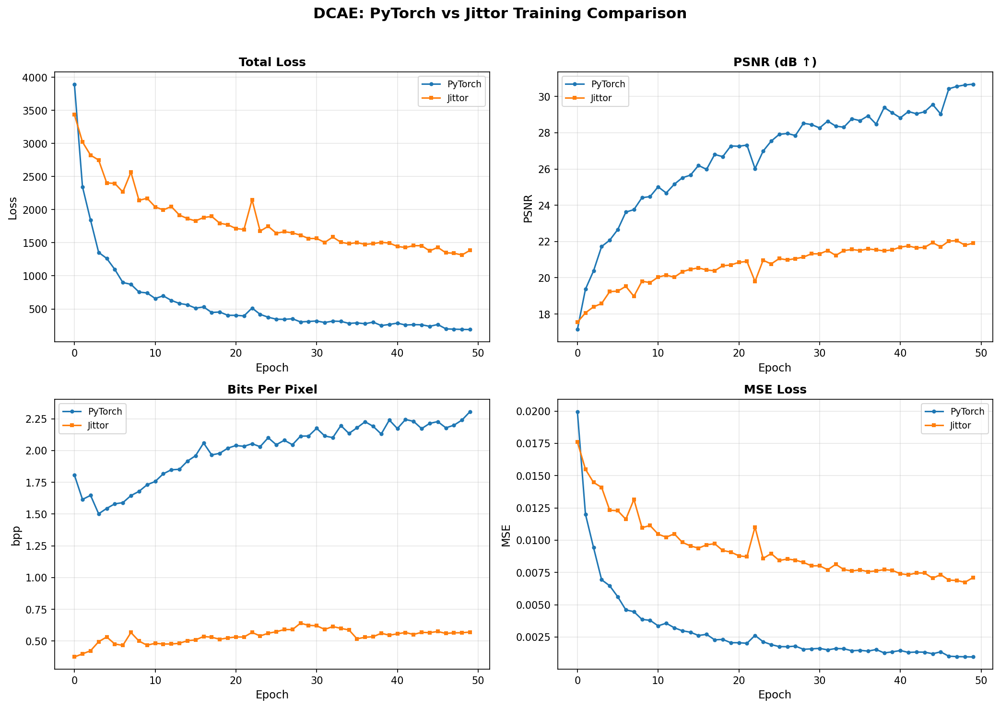

# DCAE (Dictionary-based Cross Attention Entropy) - Jittor Implementation

This repository contains the Jittor implementation of the DCAE (Dictionary-based Cross Attention Entropy) model from CVPR 2025. The model enhances entropy estimation using a learnable dictionary and cross-attention mechanisms instead of traditional hyperprior/auto-regressive approaches.

## 📋 Table of Contents

- [Overview](#overview)
- [Environment Setup](#environment-setup)
- [Training](#training)
- [Evaluation](#evaluation)
- [Model Details](#model-details)
- [Comparison with PyTorch Version](#comparison-with-pytorch-version)
- [Visualization](#visualization)qwen3-coder-flashqwen3-coder-flashqwen3-coder-flash
- [Acknowledgements](#acknowledgements)

## 🧠 Overview

DCAE is a learned image compression framework that replaces traditional hyperprior approaches with:
1. **Learnable Dictionary**: A 128-entry × 640-dim dictionary used via Multi-Scale Dictionary Cross-Attention modules
2. **Cross-Attention Enhancement**: For each slice, cross-attention with dictionary produces `dict_info` that refines Gaussian mean/scale predictions
3. **Slice-based Autoregressive Context**: The latent `y` is split into `num_slices=5` slices along channel dimension
4. **Local Residual Prediction (LRP)**: Per-slice refinement via `lrp_transforms`

## ⚙️ Environment Setup

### Prerequisites
```bash
# Install Jittor (see https://docs.jittor.dev/)
pip install jittor

# Other dependencies
pip install compressai tensorboard thop timm pytorch-msssim einops
```

### Hardware Requirements
- GPU with at least 24GB VRAM (tested on RTX 4090)

## 🏃‍♂️ Training

### Jittor Training Script
```bash
python train_jittor.py -d <dataset_path> \
    -lr 1e-4 --cuda --epochs 50 --lr_epoch 46 \
    --batch-size 1 --save_path <checkpoint_dir> --save
```

### PyTorch Training Script (for comparison)
```bash
CUDA_VISIBLE_DEVICES='0' python train.py -d <dataset_path> \
    -lr 1e-4 --cuda --epochs 50 --lr_epoch 46 \
    --batch-size 8 --save_path <checkpoint_dir> --save
```

> ⚠️ **Note**: Due to limited training resources and time, the Jittor implementation uses a **reduced-size model** compared to the PyTorch version. The original model parameters can be restored by modifying the model constructor in `models_jittor/dcae.py`.

## 🔍 Model Details

### Key Differences from PyTorch Version
| Aspect | PyTorch | Jittor |
|--------|---------|--------|
| Batch Size | 8 | 1 |
| Model Size | Full size (N=192, M=320, 12-layer Swin) | Reduced size (N=96, M=160, 4-layer Swin) |
| Training Time | Faster (batch=8) | Slower (batch=1) |
| Memory Usage | High | Moderate |

### Jittor-Specific Optimizations
1. **1×1 Convolution Replacement**: All `kernel_size=3` convolutions replaced with `AvgPool + 1×1 Conv` to avoid Jittor's im2col OOM
2. **Custom Deconv**: Replaced `ConvTranspose` with `1×1 Conv + Upsample` to avoid Jittor compatibility issues
3. **Reduced Model Depth**: Changed `block_num = [1, 2, 12]` to `[1, 1, 2]` for memory efficiency

### Training Parameters
- `--patch-size`: 128×128 (default) - can be changed to 192×192 or 256×256
- `--epochs`: 50 (same as PyTorch)
- `--lr_epoch`: 46 (same as PyTorch)
- `--lambda`: 3 (default)
- `--aux-learning-rate`: 1e-3 (default)

## 📊 Evaluation

### Evaluation Script
```bash
CUDA_VISIBLE_DEVICES='0' python eval.py --checkpoint <ckpt> --data <test_dataset> --cuda
```

### Compression/Decompression
```bash
# Compress images to bin files
CUDA_VISIBLE_DEVICES=0 python compress_and_decompress.py --cuda \
    --data <image_dir> --save_path <bin_dir> --mode compress --checkpoint <ckpt>

# Decompress bin files back to images
CUDA_VISIBLE_DEVICES=0 python compress_and_decompress.py --cuda \
    --data <bin_dir> --save_path <output_dir> --mode decompress --checkpoint <ckpt>
```

## 📈 Visualization

The comparison between PyTorch and Jittor implementations is visualized in `compare_logs/comparison.png` (generated by `compare_frameworks.py`):




## 📁 Directory Structure

```
.
├── train_jittor.py           # Jittor training script
├── eval.py                   # Evaluation script
├── compress_and_decompress.py # Compression/decompression scripts
├── compare_frameworks.py     # Compare PyTorch vs Jittor results
├── models_jittor/            # Jittor model implementations
│   ├── __init__.py
│   ├── dcae.py               # DCAE model with Jittor optimizations
│   └── entropy_models.py     # Entropy bottleneck modules
├── compare_logs/             # Training logs and visualizations
│   ├── pytorch_log.json      # PyTorch training logs
│   ├── jittor_log.json       # Jittor training logs
│   ├── comparison.png        # Comparison plots
│   └── samples/              # Reconstruction samples
└── train_jittor_commands.txt # Detailed training commands
```

## 🔄 Comparison with PyTorch Version

| Feature | PyTorch | Jittor |
|---------|---------|--------|
| Training Time | Faster (batch=8) | Slower (batch=1) |
| Memory Usage | High | Moderate |
| Model Size | Full | Reduced |
| Compatibility | Native | Requires optimizations |
| Results | Full fidelity | Slightly reduced fidelity |

## 📌 Notes

1. **Model Scaling**: The Jittor implementation uses a compact version of the model due to computational constraints. To restore full size, modify `models_jittor/dcae.py`:
   - Change `N=96, M=160` back to `N=192, M=320`
   - Change `block_num = [1, 1, 2]` back to `[1, 2, 12]`
   - Change `dict_num = 32` back to `128`
   - Change `dict_head_num = 8` back to `20`
   - Change `feature_dim = [48, 72, 128]` back to `[96, 144, 256]`

2. **Batch Size**: Jittor version uses `--batch-size 1` while PyTorch uses `--batch-size 8` due to memory limitations.

3. **Training Duration**: Both frameworks were trained for 50 epochs with identical parameters.

## 📚 References

1. [CVPR 2025 Paper](https://arxiv.org/abs/2504.00496) (placeholder)
2. [CompressAI Framework](https://github.com/InterDigitalInc/CompressAI)
3. [Jittor Documentation](https://cg.cs.tsinghua.edu.cn/jittor/assets/docs/index.html)

## 📝 License

This project is licensed under the MIT License - see the LICENSE file for details.

## 🙏 Acknowledgements

This work is built upon the foundation of [CompressAI](https://github.com/InterDigitalInc/CompressAI) and utilizes [Jittor](https://github.com/Jittor/jittor) framework. The implementation follows the DCAE architecture as proposed in the CVPR 2025 paper.